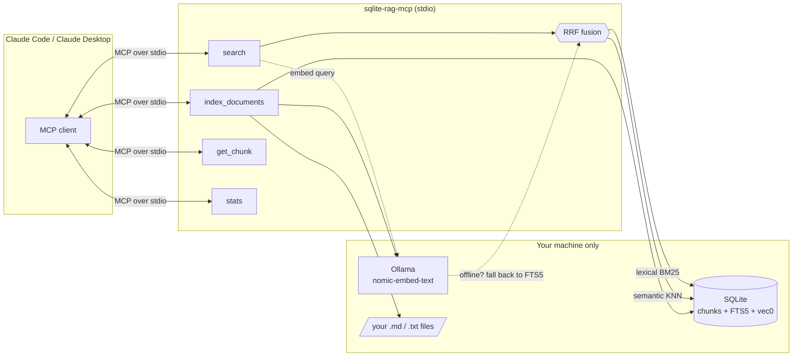

# sqlite-rag-mcp

> 100% offline RAG as an MCP server — index your documents into SQLite (sqlite-vec + FTS5, hybrid RRF search, local Ollama embeddings) and search them from Claude. **Your documents never leave your machine.**

## 🇺🇸 English

### Why

Most RAG stacks ship your documents to a hosted vector database and an embeddings API. This one doesn't. Everything — storage, vectors, lexical index, embeddings — runs locally:

- **One SQLite file** is the whole index. No services to run, nothing to babysit. Back it up with `cp`.
- **Hybrid search**: [sqlite-vec](https://github.com/asg017/sqlite-vec) vector KNN + FTS5 BM25, fused with Reciprocal Rank Fusion (RRF) — better recall than either alone.
- **Local embeddings** via [Ollama](https://ollama.com) (`nomic-embed-text` by default).
- **Graceful degradation**: if Ollama isn't running, indexing and search still work in lexical (FTS5) mode with an explicit warning. Search never breaks.

### Architecture



### Install

Requires Python ≥ 3.10. Not yet published to PyPI — install from a clone of this repository:

```bash
git clone https://github.com/giuseppeferretti/sqlite-rag-mcp
cd sqlite-rag-mcp
pip install .
```

For semantic search, also install [Ollama](https://ollama.com) and pull the embedding model:

```bash
ollama pull nomic-embed-text   # optional — lexical search works without it
```

### Configure Claude Code / Claude Desktop

Add to your MCP settings (`claude mcp add` or `claude_desktop_config.json`):

```json
{
  "mcpServers": {
    "sqlite-rag": {
      "command": "sqlite-rag-mcp",
      "env": {
        "SQLITE_RAG_DB": "~/.local/share/sqlite-rag-mcp/index.db"
      }
    }
  }
}
```

Or with Claude Code CLI:

```bash
claude mcp add sqlite-rag -- sqlite-rag-mcp
```

| Environment variable | Default | Purpose |
| --- | --- | --- |
| `SQLITE_RAG_DB` | `~/.local/share/sqlite-rag-mcp/index.db` | Index database path |
| `OLLAMA_HOST` | `http://localhost:11434` | Ollama endpoint |
| `SQLITE_RAG_EMBED_MODEL` | `nomic-embed-text` | Embedding model |
| `SQLITE_RAG_CHUNK_TOKENS` | `800` | Chunk size (approx. tokens) |
| `SQLITE_RAG_CHUNK_OVERLAP` | `100` | Chunk overlap (approx. tokens) |

### Tools

**`index_documents(path, glob="**/*.md")`** — index text/markdown files from a directory. Unchanged files (same SHA-256) are skipped, changed files are re-chunked and re-embedded.

> *"Index everything under ~/notes"* → `index_documents(path="~/notes")` →
> `{"files_indexed": 42, "chunks_added": 310, "chunks_embedded": 310, "warnings": []}`

**`search(query, k=8, mode="hybrid")`** — search the index. Modes: `hybrid` (RRF fusion, default), `semantic` (vector KNN), `lexical` (FTS5 BM25). With Ollama offline, `hybrid`/`semantic` fall back to `lexical` and the response carries a `warning` — it never errors.

> *"How do I rotate API tokens?"* →
> `{"mode_used": "hybrid", "results": [{"chunk_id": 17, "score": 0.0325, "snippet": "Generate a token with…", "source": "…/authentication.md", "title": "Authentication and API Tokens", "matched_by": "semantic+lexical"}]}`

**`get_chunk(chunk_id)`** — full text + source of a chunk returned by `search`.

**`stats()`** — document/chunk/embedding counts, DB path and size, Ollama availability.

### CLI indexing (outside MCP)

```bash
python -m sqlite_rag_mcp.index ~/notes --glob "**/*.md"
python -m sqlite_rag_mcp.index ~/docs --glob "**/*.txt" --db /tmp/docs.db
```

### How search works

1. The query is embedded locally (Ollama) and run against the `vec0` KNN index; in parallel a sanitized, OR-expanded prefix query runs against FTS5 (BM25).
2. Both rankings are fused with **Reciprocal Rank Fusion**: `score(chunk) = Σ 1/(60 + rank + 1)` across the two lists — a rank-based method that needs no score calibration between BM25 and cosine distance.
3. Top-k fused chunks are returned with snippet, source path, and which ranker(s) matched them.

### Provenance

This server is the extracted, genericized search core of a production RAG system that indexes and answers questions over a company's document corpus — fully offline, on commodity hardware. Case study at [portfolio.iterlabs.com.br](https://portfolio.iterlabs.com.br).

### Development

```bash
pip install -e ".[dev]"
pytest   # includes a real stdio smoke test that spawns the server and drives it with the MCP SDK client
```

---

## 🇧🇷 Português

> RAG 100% offline como servidor MCP — indexe seus documentos em SQLite (sqlite-vec + FTS5, busca híbrida RRF, embeddings locais via Ollama) e pesquise-os a partir do Claude. **Seus documentos nunca saem da sua máquina.**

### Por quê

- **Um único arquivo SQLite** é o índice inteiro — sem serviços externos; backup com `cp`.
- **Busca híbrida**: KNN vetorial (sqlite-vec) + BM25 (FTS5), fundidos com Reciprocal Rank Fusion.
- **Embeddings locais** via Ollama (`nomic-embed-text`).
- **Degradação graciosa**: sem Ollama, indexação e busca continuam funcionando em modo lexical (FTS5) com aviso explícito — a busca nunca quebra.

### Instalação e configuração

Ainda não publicado no PyPI — instale a partir de um clone deste repositório:

```bash
git clone https://github.com/giuseppeferretti/sqlite-rag-mcp
cd sqlite-rag-mcp
pip install .
ollama pull nomic-embed-text   # opcional — busca lexical funciona sem
```

No Claude Code / Claude Desktop:

```json
{
  "mcpServers": {
    "sqlite-rag": { "command": "sqlite-rag-mcp" }
  }
}
```

Banco em `~/.local/share/sqlite-rag-mcp/index.db` por padrão (configurável via `SQLITE_RAG_DB`).

### Ferramentas

- `index_documents(path, glob)` — indexa arquivos texto/markdown de um diretório (arquivos inalterados são pulados).
- `search(query, k, mode)` — `hybrid` (padrão), `semantic` ou `lexical`; com Ollama offline, cai para `lexical` com aviso.
- `get_chunk(chunk_id)` — texto completo de um trecho.
- `stats()` — contagens e estado do índice.

CLI: `python -m sqlite_rag_mcp.index <dir> --glob "**/*.md"`.

### Origem

Núcleo de busca extraído e generalizado de um sistema RAG em produção que responde perguntas sobre o corpus documental de uma empresa — totalmente offline. Case em [portfolio.iterlabs.com.br](https://portfolio.iterlabs.com.br).

---

*Built with AI-assisted development; designed, verified, and operated by Giuseppe Ferretti.*
